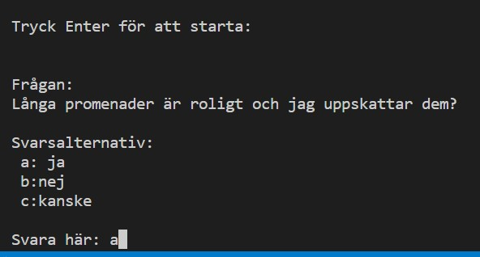
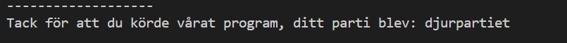

# Valbarometer
Mitt slutprojekt i Programmering 1. Här gör jag en valbarometer. 

Alexander Rehnman
•
13:00

NL_README.md
Text
Klasskommentarer

## Beskrivning

Mitt program är en valbarometer som är skrivet i programmeringsspråket Python. Programmet har i uppgift att med hjälp av filhantering och klasser att välja ut ett av tre olika "partier" som du mest hör samman med.

## Byggt med

- Python

## Krav

- Python 3.9+

## Installation

Detta projekt är testat på Python 3.9+. För att installera Python kan du besöka (https://www.python.org/downloads/)[följande länk för senaste versionen.]

## Hur det fungerar

***Använd detta utrymme för att visa användbara exempel av hur projektet kan användas. Skärmdumpar, kodexempel och demos passar in här. Du kan också länka till fler resurser, exempelvis en dokumentation.***

## Example (exempelkörning)

## Att göra/Plan

- [x] Påbörja exempelreadme
- [ ] Hitta fler exempelrubriker
- [ ] Kom på bättre exempel
- [ ] Ge exempel på projekt med fullständig readme
- [ ] Ytterligare språk
    - [x] Svenska
    - [x] Engelska

## Changelog

***Det kan vara rimligt att inkludera vad som har förändrats genom de olika iterationerna som ditt projekt gått igenom. Detta kan antingen göras i din README eller så kan du inkludera en CHANGELOG.md.***

***I changelogen ska varje rubrik vara en version. Under varje version bör du inkludera vad du lagt till eller ändrat på (added or changed) under en rubrik samt vad du tagit bort (removed) under en annan. Exempel: ***

### Version 1.0.1

#### Tillagt eller ändrat

- La till avsnitt om changelog
- La till avsnitt om kodkonventioner

#### Borttaget

- Tog bort tidigare kommentarer som inte passade in.

## Att bidra 

Då bedömning ännu ej är gjord på uppgiften så tillåts inga pull requests. Så fort bedömning är gjord kommer detta tillåtas.  

Vid större förändringar önskar jag att en issue öppnas för diskussion om vad som ska förändras.

## Licens

[MIT](https://choosealicense.com/licenses/mit/)

## Kontakt

Kan bli kontaktad på följande plattformar:

- Snapchat: Alexander2004r2
- Instagram:@Alexanderrehnman
- Gmail:Alexanderrehnman2004@gmail.com

Projektlänk: https://github.com/ditt_anv/reponamn

## Erkännanden

- Niclas Lund
- https://www.w3schools.com/

